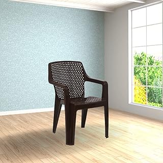
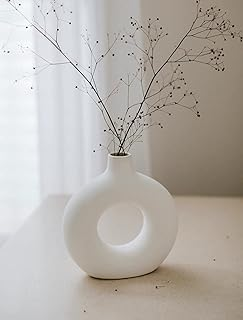
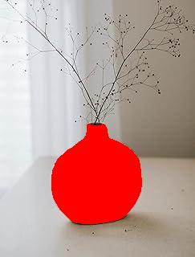
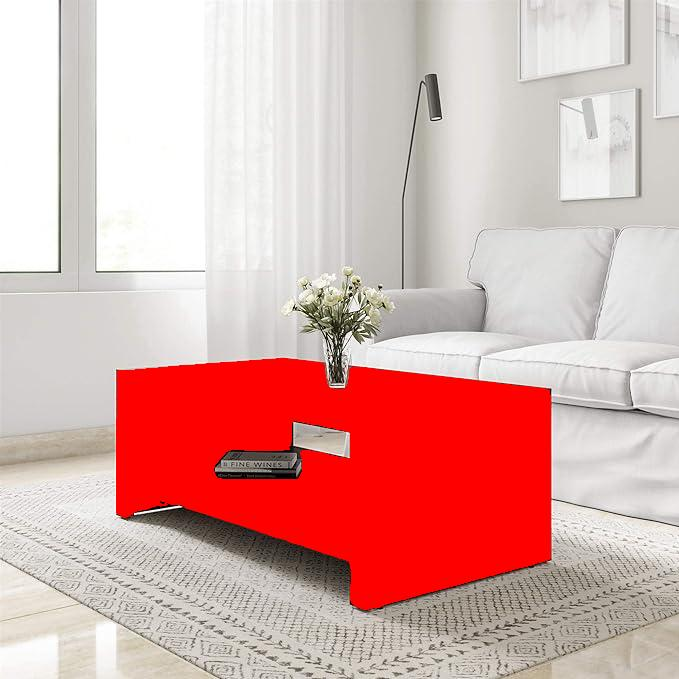
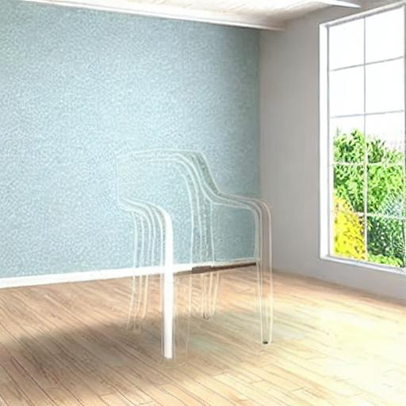

# Object Pose Editor
| Input Image | Rotate Pose by Azimuth 45, Chair | 
| :---:   | :---: | 
|  |  |

## Assumptions 

1. Assume every image contains only one instance of the queried class. If more than one instance of the object exists, only one of it will be chosen.
2. The class of the queried object needs to be a common object class that is part of the widely available large scale vision dataset. Otherwise, the pretrained models cannot be used in this approach to solve the problem.

## Task 1

## Problem Statement

Mask the queried object with red colour

## Possible Solutions

### Method 1 

Is there a model that can directly identify the object based on the text prompt?

### Method 2

1. Get all the segmentation mask and bounding boxes in the image.
2. Crop the bounding box of each object instance.
3. Use a Multi-model model such as [CLIP](https://openai.com/research/clip) that can classify each bounding box instance with a text prompt.
4. Mask the assigned Bounding box with red color.

## Solution Approach

For the solution, after an initial review of available open source models, I decided to use Method 1. I used the [Language Segment-Anything](https://github.com/luca-medeiros/lang-segment-anything) from Luca Medeiros to mask the queried object. This uses a combination of two promienent model
1. [Segment Anything Model (SAM)](https://segment-anything.com/) from Meta AI that aims at zero shot open-world image segmentation.
2. [GroundingDINO](https://github.com/IDEA-Research/GroundingDINO) from IDEA-Research that extends the self supervised [DINO](https://github.com/facebookresearch/dino) model from Facebook Research to open set object detection.

#### Code
The exported conda environment file is located in `environment.yml`.
Input images are located in `sample_input_images`. Outputs generated by the task are located at 'task1_output_images'.


```
python main_task_1.py --image "sample_input_images/chair.jpg" --class "chair" --output "task1_output_images/chair.jpg"

```

 #### Results


 This approach works extremely well for the sample images that are provided with the problem set. Here are the visual outputs of the same:
 

 | Input Image | Masked Image    |  Input Image | Masked Image      | Input Image | Masked Image      |
| :---:   | :---: | :---: | :---: |:---: | :---: |
|  |   | .jpg)   |.jpg)   |   |
|    |  |    |   |   |
|    |   |   |

## Task 2
## Problem Statement

Change the pose of the queried object preserving the scene.

## Solution Approach

**Task 2.1**  Inpaint the Image to remove the queried object and complete the scene  
**Task 2.2**  Synthesize novel object view from the polar and azimuth angles of the queried object   
**Task 2.3** Overlay the object back into the inpainted image by anchoring the novel view center with the bounding box center from Task 1.


### Task 2.1 - Inpaint the Image to remove the object and complete the scene  

For inpainting the scene, I used the [Stable Diffusion Model](https://huggingface.co/runwayml/stable-diffusion-inpainting) from Runway ML and with the Inpainting checkpoint. Text prompt used is "background".

Outputs generated by the task are located at `task_2_inter_output_images`.

#### Code
```
python main_task_2_2.py --image "sample_input_images/chair.jpg" --class "chair" --output "task_2_inter_output_images/chair.jpg"

```
#### Result


| Input Image | Inpainted Image | 
| :---:   | :---: | 
|  |  |


Unfortunately, this prompt and model did not work for the other images in the sample set.

### Task 2.2 - Synthesize novel object view from the polar and azimuth angles 

For this task, I intended to use the [Zero-1-to-3](https://github.com/cvlab-columbia/zero123) model from Columbia University and Toyota Research Institute. However I could not get the model to run locally on the machine within the stipulated time.

With this model, and similar to the implementation in [Stable-zero123](https://huggingface.co/spaces/p4vv37/Stable-zero123), it is possible to get the cropped queried object and synthesize a novel view based on the polar and azimuth angles.

Here is an example with azimuthal rotation of 45 degrees that was generated from the mentioned HuggingFace space.

#### Results


| Input Image | Inpainted Image | 
| :---:   | :---: | 
|  |  |

### Task 2.3 Overlay the Novel View back into the inpainted image.

Once the novel view is obtained, it can be resized to the cropped object. This novel view can be directly overlaid with the center in the same position as that of queried object's bounding box.

#### Code

```
python main_task_2_3.py
```
#### Results

| Input Image | Rotate Pose by Azimuth 45, Chair | 
| :---:   | :---: | 
|  |  |


## Challenges

1. Currently the Task 2 works for the first sample image. With enough time and compute capacity, it must be possible to experiment with more inpainting and novel view synthesis models that can work with all the sample images.

2. Solving Dependencies between multiple repositories with respect to CUDA and package version was quite time consuming. Finally, I resorted to running Task 1 only on the CPU to circumvent CUDA dependencies.

